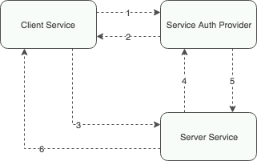

1. Client Service signs in using its name and otp
2. Service Auth Provider returns a token
3. Client Service makes a request to Server Service with the token in headers
4. Server Service validates the token
5. Service Auth Provider returns the validation response
6. Server Service sends a response to Client Service
